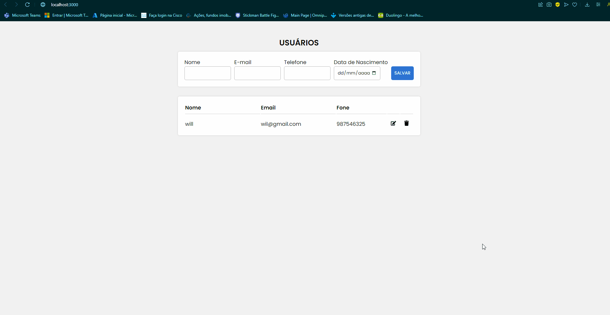

<h1>A simple crud for React</h1>

 A crud for create, edit, delete the usuario. 
 the system is well direct and pratic. 
 the goal is training the react and that the code be useful for other people's. 

>for start project, open two terminal. 

this is code for the first terminal:
+ cd api
+ npm start
  
here we start the Api for get the data from the bank.

  
it is code for the second terminal:
+ cd frontend
+ npm start

here we start the servidor from the web.

Example from the application:
<h1 align="center"></h1>

Technologies used:
* React
* Node
* Mysql

>Thanks for read the project. 
